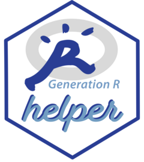

<!-- README.md is generated from README.Rmd. Please edit that file -->

```{r, include = FALSE}
knitr::opts_chunk$set(
  collapse = TRUE,
  comment = "#>",
  fig.path = "man/figures/README-",
  out.width = "100%"
)
```

# `genR.helpR` 

<!-- badges: start -->

<!-- badges: end -->

This a collection of helper functions for working with **Generation R** data.

[Generation R](https://generationr.nl/) is a large birth cohort study based in Rotterdam (the Netherlands), over the last 25 years, it collected a wide range of health information from \~10.000 children and their families.

See the [**GuRu**](https://seredef-guru.share.connect.posit.cloud/) for an interactive view of the available data collected.

### TODO:

[ ] Document, add refactoring functions

## Installation

You can install the development version of `genR.helpR` from [GitHub](https://github.com/) with:

```{r, eval=FALSE}
# install.packages("pak")
pak::pak("SereDef/genR.helpR")
```

## Example

```{r example}
library(genR.helpR)
## basic example code
```